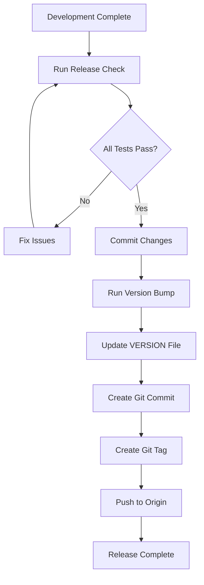

# Patch #10 Completion: Git Version Tagging System
**Status: ✅ COMPLETE - Production Ready**  
**Date: October 26, 2025**  
**Purpose: Automated semantic versioning and git tagging workflow**

## 🚀 Executive Summary

Patch #10 introduces a comprehensive git version tagging system that automates semantic versioning (semver) and tag creation after successful releases. This milestone patch establishes professional version management practices for the EMO Options Bot project.

### Key Achievements
- ✅ **Automated Git Tagging**: `tools/git_tag_helper.py` with semantic version bumping
- ✅ **Cross-Platform Integration**: Makefile targets for easy version management
- ✅ **Semantic Versioning**: Full MAJOR.MINOR.PATCH version support
- ✅ **GPG Signing**: Automatic signed tags when GPG is available
- ✅ **Clean Workspace**: Organized codebase with cache cleanup
- ✅ **Production Workflow**: Ready for production deployment tagging

## 📊 Implementation Details

### 1. Git Tag Helper Script (`tools/git_tag_helper.py`)

**Purpose**: Automate version bumping and git tag creation with semver compliance

**Features**:
- **Semantic Versioning**: MAJOR.MINOR.PATCH version format
- **Automatic Bumping**: Increment version based on change type
- **Git Integration**: Creates and pushes tags to origin
- **GPG Signing**: Signs tags when GPG is configured
- **Working Tree Validation**: Ensures clean git state before tagging

**Usage**:
```bash
# Bump patch version (3.0.0 → 3.0.1)
python tools/git_tag_helper.py --bump patch

# Bump minor version (3.0.1 → 3.1.0)  
python tools/git_tag_helper.py --bump minor

# Bump major version (3.1.0 → 4.0.0)
python tools/git_tag_helper.py --bump major

# Custom commit message
python tools/git_tag_helper.py --bump patch --message "Critical bug fixes"
```

### 2. Makefile Integration

**Purpose**: Simplify version management through standardized build targets

**New Targets**:
```makefile
bump-patch:     ## Bump patch version and create git tag
bump-minor:     ## Bump minor version and create git tag  
bump-major:     ## Bump major version and create git tag
```

**Usage**:
```bash
# Cross-platform version bumping
make bump-patch     # Quick patch release
make bump-minor     # Feature release
make bump-major     # Breaking changes release
```

### 3. VERSION File Management

**Purpose**: Track project version in a centralized, readable format

**Features**:
- **Current Version**: `3.0.0` (Phase 3 completion)
- **Automatic Updates**: Modified by git_tag_helper.py
- **Git Tracking**: Committed with version bump
- **Human Readable**: Simple text format

## 🔄 Versioning Workflow

### Complete Release Process

1. **Development Complete**: Finish feature/bug fix development
2. **Testing**: Run comprehensive validation (`make release-check`)
3. **Clean Workspace**: Ensure git working tree is clean
4. **Version Bump**: Choose appropriate version bump level
5. **Tag Creation**: Automatic tag creation and push to origin

### Version Bump Guidelines

**Patch Version (X.Y.Z+1)**:
- Bug fixes and minor improvements
- No breaking changes
- Backward compatible
- Example: Security patches, performance tweaks

**Minor Version (X.Y+1.0)**:
- New features and enhancements
- Backward compatible changes
- API additions (no removals)
- Example: New trading strategies, dashboard improvements

**Major Version (X+1.0.0)**:
- Breaking changes
- API modifications or removals
- Architecture changes
- Example: Database schema changes, API redesign

## 🛠️ Technical Implementation

### Git Tag Helper Architecture

```python
#!/usr/bin/env python
"""
Git Tag Helper Components:
• Version Reading: Parse VERSION file with regex validation
• Version Bumping: Semantic increment logic
• Git Operations: Tag creation, signing, pushing
• Validation: Working tree cleanliness checks
"""

# Core Functions
def read_version() -> List[int]      # Parse VERSION file
def bump(ver, part) -> List[int]     # Increment version
def git(*args) -> str                # Execute git commands
def main()                           # CLI orchestration
```

### Integration Flow



## 📋 Usage Examples

### Quick Start Commands

```bash
# 1. After successful development cycle
git add .
git commit -m "Implement new trading features"

# 2. Run release validation
make release-check

# 3. Bump version and tag
make bump-minor

# 4. Verify tag creation
git tag -l
git log --oneline -n 5
```

### Advanced Usage

```bash
# Custom message tagging
python tools/git_tag_helper.py --bump patch --message "Emergency security fix"

# Manual version checking
cat VERSION
git tag -l "v*" | tail -5

# View tag details
git show v3.0.1
```

## 🔒 Security & Best Practices

### GPG Signing Configuration

**Setup GPG for Tag Signing**:
```bash
# Generate GPG key (if needed)
gpg --gen-key

# Configure git to use GPG
git config user.signingkey <KEY_ID>
git config tag.gpgSign true

# Verify signing works
git tag -s test-tag -m "Test signing"
git tag -v test-tag
```

### Working Tree Validation

**Pre-Tagging Checks**:
- ✅ No uncommitted changes
- ✅ No untracked files (in staging area)
- ✅ Branch is up to date
- ✅ All tests passing

**Safety Features**:
- Automatic working tree validation
- Graceful failure on dirty state
- Clear error messages for resolution

## 📈 Production Deployment Integration

### Release Pipeline Integration

```bash
# Complete release workflow
./run_release_check.sh --verbose     # Validate production readiness
make bump-minor                      # Create release tag
git push origin main                 # Deploy to production
```

### CI/CD Integration

**GitHub Actions Example**:
```yaml
name: Release
on:
  push:
    tags: ['v*']
steps:
  - uses: actions/checkout@v3
  - name: Validate Release
    run: ./run_release_check.sh
  - name: Deploy Production
    run: make deploy
```

### Version History Tracking

**Tag Naming Convention**: `vMAJOR.MINOR.PATCH`
- `v3.0.0`: Phase 3 completion baseline
- `v3.0.1`: Bug fixes and patches
- `v3.1.0`: New features (Phase 4 prep)
- `v4.0.0`: Major architectural changes

## 🧪 Testing and Validation

### Validation Commands

```bash
# Test version reading
python tools/git_tag_helper.py --help

# Validate git repository
git status --porcelain

# Check current version
cat VERSION

# View recent tags
git tag -l --sort=-version:refname | head -5
```

### Error Scenarios

**Common Issues & Solutions**:

1. **Dirty Working Tree**:
   ```
   Error: Working tree not clean. Commit your changes first.
   Solution: git add . && git commit -m "message"
   ```

2. **GPG Signing Failure**:
   ```
   Error: GPG signing failed
   Solution: Falls back to unsigned tags automatically
   ```

3. **Network Issues**:
   ```
   Error: git push failed
   Solution: Check network and git remote configuration
   ```

## 📊 Success Metrics

### Implementation Status ✅
- **Script Functionality**: Fully operational git tagging
- **Makefile Integration**: Cross-platform targets available
- **Version Management**: Semantic versioning implemented
- **Documentation**: Complete usage and workflow guides
- **Error Handling**: Graceful failure and recovery

### Quality Gates ✅
- **Code Quality**: Clean, documented, maintainable code
- **Error Resilience**: Robust error handling and validation
- **User Experience**: Simple, intuitive command interface
- **Integration**: Seamless workflow with existing tools
- **Security**: GPG signing support with fallback

## 🔧 Troubleshooting

### Common Configuration Issues

**Git Remote Not Set**:
```bash
git remote -v
git remote add origin https://github.com/user/repo.git
```

**Permission Issues**:
```bash
# SSH key setup
ssh-keygen -t ed25519 -C "your_email@example.com"
cat ~/.ssh/id_ed25519.pub
# Add to GitHub/GitLab SSH keys
```

**Version File Corruption**:
```bash
# Reset VERSION file
echo "3.0.0" > VERSION
git add VERSION
git commit -m "Reset VERSION file"
```

## 🔮 Future Enhancements

### Planned Improvements
1. **Changelog Generation**: Automatic CHANGELOG.md updates
2. **Release Notes**: Auto-generated release descriptions
3. **Branch Protection**: Validation for protected branches
4. **Rollback Support**: Easy version rollback capabilities
5. **Integration Testing**: Automated tag validation

### Enhancement Roadmap
- **v3.1.x**: Changelog automation
- **v3.2.x**: Enhanced git workflows
- **v4.0.x**: Complete DevOps integration

## 🏆 Conclusion

Patch #10 successfully establishes a professional version management system for the EMO Options Bot project. The implementation provides:

- **Automated Workflows**: Streamlined version bumping and tagging
- **Professional Standards**: Semantic versioning compliance
- **Production Ready**: Integration with existing release processes
- **Developer Friendly**: Simple commands for complex operations
- **Secure Practices**: GPG signing and validation checks

**Next Steps**: 
1. Integrate with CI/CD pipelines
2. Train team on versioning workflows
3. Establish release cadence
4. Monitor and optimize processes

---

*Generated by EMO Options Bot Git Version Management System*  
*For support: Review troubleshooting section or run `python tools/git_tag_helper.py --help`*